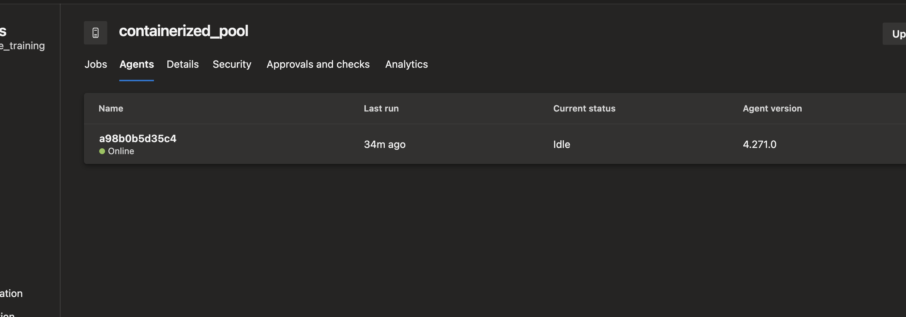

##  devops agent in a container

Azure devops agent can be run inside the container by creating the proper docker image with all the necessary binaries required to run the pipeline and run the start.sh once we start the container. Below is the docker file and start.sh script.

```start.sh
#!/bin/bash
set -e

if [ -z "${AZP_URL}" ]; then
  echo 1>&2 "error: missing AZP_URL environment variable"
  exit 1
fi

if [ -n "$AZP_CLIENTID" ]; then
  echo "Using service principal credentials to get token"
  az login --allow-no-subscriptions --service-principal --username "$AZP_CLIENTID" --password "$AZP_CLIENTSECRET" --tenant "$AZP_TENANTID"
  # adapted from https://learn.microsoft.com/en-us/azure/databricks/dev-tools/user-aad-token
  AZP_TOKEN=$(az account get-access-token --query accessToken --output tsv)
  echo "Token retrieved"
fi

if [ -z "${AZP_TOKEN_FILE}" ]; then
  if [ -z "${AZP_TOKEN}" ]; then
    echo 1>&2 "error: missing AZP_TOKEN environment variable"
    exit 1
  fi

  AZP_TOKEN_FILE="/azp/.token"
  echo -n "${AZP_TOKEN}" > "${AZP_TOKEN_FILE}"
fi

unset AZP_CLIENTSECRET
unset AZP_TOKEN

if [ -n "${AZP_WORK}" ]; then
  mkdir -p "${AZP_WORK}"
fi

cleanup() {
  trap "" EXIT

  if [ -e ./config.sh ]; then
    print_header "Cleanup. Removing Azure Pipelines agent..."

    # If the agent has some running jobs, the configuration removal process will fail.
    # So, give it some time to finish the job.
    while true; do
      ./config.sh remove --unattended --auth "PAT" --token $(cat "${AZP_TOKEN_FILE}") && break

      echo "Retrying in 30 seconds..."
      sleep 30
    done
  fi
}

print_header() {
  lightcyan="\033[1;36m"
  nocolor="\033[0m"
  echo -e "\n${lightcyan}$1${nocolor}\n"
}

# Let the agent ignore the token env variables
export VSO_AGENT_IGNORE="AZP_TOKEN,AZP_TOKEN_FILE"

print_header "1. Determining matching Azure Pipelines agent..."

AZP_AGENT_PACKAGES=$(curl -LsS \
    -u user:$(cat "${AZP_TOKEN_FILE}") \
    -H "Accept:application/json" \
    "${AZP_URL}/_apis/distributedtask/packages/agent?platform=${TARGETARCH}&top=1")

AZP_AGENT_PACKAGE_LATEST_URL=$(echo "${AZP_AGENT_PACKAGES}" | jq -r ".value[0].downloadUrl")

if [ -z "${AZP_AGENT_PACKAGE_LATEST_URL}" -o "${AZP_AGENT_PACKAGE_LATEST_URL}" == "null" ]; then
  echo 1>&2 "error: could not determine a matching Azure Pipelines agent"
  echo 1>&2 "check that account "${AZP_URL}" is correct and the token is valid for that account"
  exit 1
fi

print_header "2. Downloading and extracting Azure Pipelines agent..."

curl -LsS "${AZP_AGENT_PACKAGE_LATEST_URL}" | tar -xz & wait $!

source ./env.sh

trap "cleanup; exit 0" EXIT
trap "cleanup; exit 130" INT
trap "cleanup; exit 143" TERM

print_header "3. Configuring Azure Pipelines agent..."

# Despite it saying "PAT", it can be the token through the service principal
./config.sh --unattended \
  --agent "${AZP_AGENT_NAME:-$(hostname)}" \
  --url "${AZP_URL}" \
  --auth "PAT" \
  --token $(cat "${AZP_TOKEN_FILE}") \
  --pool "${AZP_POOL:-Default}" \
  --work "${AZP_WORK:-_work}" \
  --replace \
  --acceptTeeEula & wait $!

print_header "4. Running Azure Pipelines agent..."

chmod +x ./run.sh

# To be aware of TERM and INT signals call ./run.sh
# Running it with the --once flag at the end will shut down the agent after the build is executed
./run.sh "$@" & wait $!

```

Below is the docker file to create the agent 

```Dockerfile
FROM ubuntu:24.04
ENV TARGETARCH="linux-arm64"
# Also can be "linux-arm", "linux-arm64".

RUN apt update && \
  apt upgrade -y && \
  apt install -y curl git jq libicu74 && \
  apt install -y maven openjdk-17-jdk
  
# Install Azure CLI
RUN curl -sL https://aka.ms/InstallAzureCLIDeb | bash

WORKDIR /azp/

COPY ./start.sh ./
RUN chmod +x ./start.sh

# Create agent user and set up home directory
RUN useradd -m -d /home/agent agent
RUN chown -R agent:agent /azp /home/agent

USER agent
# Another option is to run the agent as root.
# ENV AGENT_ALLOW_RUNASROOT="true"

ENTRYPOINT [ "./start.sh" ]
```

By running the below command, you can start the container, you need to send the env variable like ORGANOSATION , PAT TOKEN, and AGENT_POOK name so start.sh can run and shown as online in the devops portal.

```
docker run -d -t -e AZP_URL=https://dev.azure.com/sivabalaji280 \
           -e AZP_TOKEN=2roh3mtRfY1pUw1Ek23g83PYFq10Wbyfn1J2GHXNNk2bllJdYYY1JQQJ99CDACAAAAAAAAAAAAASAZDO3dgF \
           -e AZP_POOL=containerized_pool \
           --name azp-agent \
           azp-java-agent:latest
```

