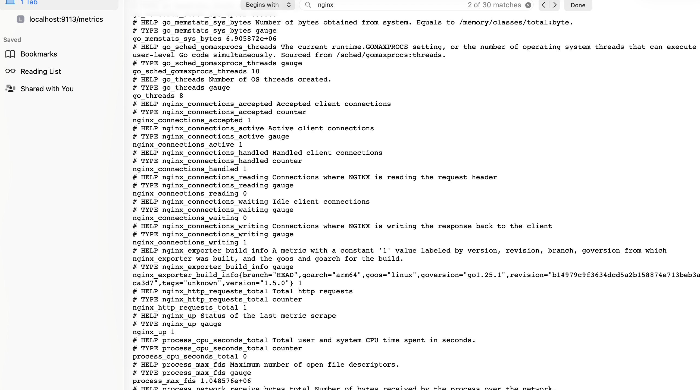
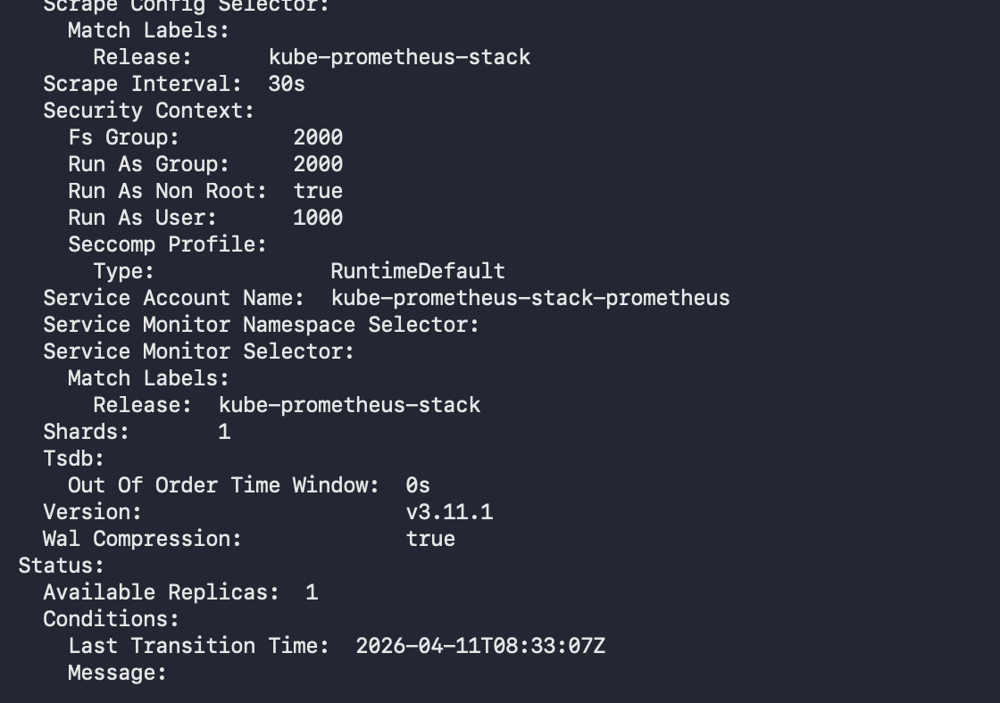
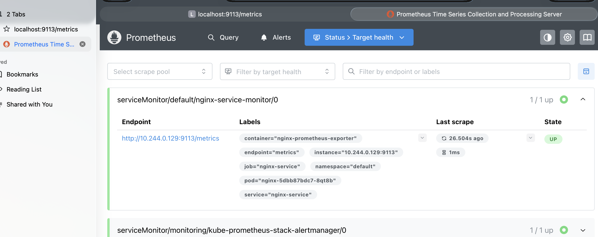
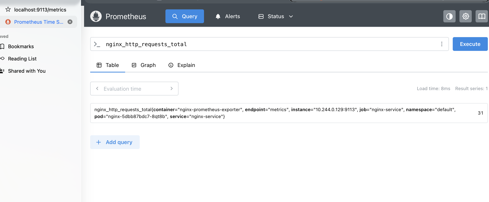
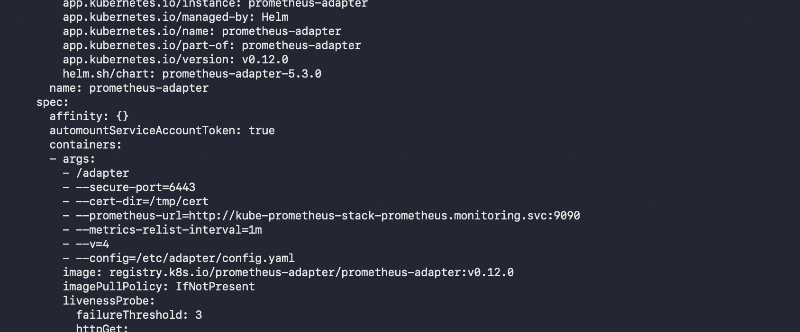

## Procedure to setup of the HPA using the custom metrics.

First add the promethues helm repository

´´´
helm repo add prometheus-community https://prometheus-community.github.io/helm-charts
helm repo update
helm upgrade --install kube-prometheus-stack prometheus-community/kube-prometheus-stack -n monitoring
´´´

Now as prometheus setup has been done, lets install the nginx setup which we will scale it using the custom metrics.

Below is the confif file you use to cretae the ngnix deployment

´´´config.yaml
apiVersion: v1
kind: ConfigMap
metadata:
  name: nginx-config
data:
  nginx.conf: |
    server {
        listen 80;
        location / {
            root /usr/share/nginx/html;
            index index.html;
        }
        location /nginx_status {
            stub_status;
            allow all;
        }

    }
´´´
Then create the deployment and service file usingf the below yaml files.

´´´deployment.yaml
apiVersion: apps/v1
kind: Deployment
metadata:
  name: nginx
spec:
  replicas: 1
  selector:
    matchLabels:
      app: nginx
  template:
    metadata:
      labels:
        app: nginx
    spec:
      containers:
      - name: nginx
        image: nginx:latest
        ports:
        - containerPort: 80
        volumeMounts:
        - name: nginx-config-volume
          mountPath: /etc/nginx/conf.d
        resources:
          limits:
            cpu: "500m"
            memory: "256Mi"
          requests:
            cpu: "250m"
            memory: "128Mi"
      
      - name: nginx-prometheus-exporter
        image: nginx/nginx-prometheus-exporter:latest
        args:
        - "-nginx.scrape-uri=http://localhost/nginx_status"
        ports:
        - containerPort: 9113

      volumes:
      - name: nginx-config-volume
        configMap:
          name: nginx-config

---

apiVersion: v1
kind: Service
metadata:
  name: nginx-service
  labels:
    app: nginx
spec:
  selector:
    app: nginx
  ports:
  - protocol: TCP
    port: 80
    targetPort: 80
    name: http
  - protocol: TCP
    port: 9113
    targetPort: 9113
    name: metrics
  type: ClusterIP
´´´

Now check if the metrics is available at http://localhost:9113/metrcis

it should show something like this with nginx_up 1 which says it is able to get the metrics from nginx container and make it available at /metrics endpoint on port 9113

Now since we have deployment, and service reasy to reach out to the nginx server, we need to create the servicemonitor to tell the promethesu where is the pod is and also make it to scrape the metrics. 

Create the serviceminitor using below yaml file.

´´´servicemonitor.yaml
apiVersion: monitoring.coreos.com/v1
kind: ServiceMonitor
metadata:
  name: nginx-service-monitor
  labels:
    release: kube-prometheus-stack 
spec:
  selector:
    matchLabels:
      app: nginx
  endpoints:
  - port: metrics
    interval: 15s 
    path: /metrics
  namespaceSelector:
    matchNames:
    - default

    
´´´

- Here the prometheus operator uses certain lables to match the service minitor to reach out to the pods to scrape the metrics. so make sure tp have that lable put in the service minitor. 

Inorder to check if it is working oir not , check if service minitor is listing out in promethues ui targets and see if you can see the nginx_http_requests_total query .

now we have completed the half of the work flow. below are the ponrts.

- Setting up the prometheus and grafana 
- create the web application from where you get the metrics
- make sure you have a exporter to provide the metrics to the prometheus server
- Create the service minitor with proper lables so that primetheis can scraoe the metrics . 

Now lets complete the remaining set od seteos by setting up the adapter to give the metrcs back to k8s api from prometheus and create HPA and scale it accordingly. 

## Installing the prometheus adapter

´´´
helm search repo | grep adapter
helm upgrade --install prometheus-adapter prometheus-community/prometheus-adapter -n monitoring
´´´
Here you need to add the rules to the adapater , so that it can query the prometheus and give it back to the k8s apis custom metrics.

´´´rules to include in adapater config file 
- seriesQuery: 'nginx_http_requests_total{namespace!="",pod!=""}'
      resources:
        overrides:
          namespace:
            resource: namespace
          pod:
            resource: pod
      name:
        matches: "nginx_http_requests_total"
        as: "nginx_requests_per_second"
      metricsQuery: 'sum(rate(nginx_http_requests_total{<<.LabelMatchers>>}[1m])) by (<<.GroupBy>>)'
´´´

´´´
k edit -n monitoring configmaps prometheus-adapter 
k rollout restart -n monitoring deployment prometheus-adapter 

´´´

Check if the metrics avaibalbel inside the k8s cluster run the following command .
kubectl get --raw "/apis/custom.metrics.k8s.io/v1beta1" | jq

if it is showing inside the resources blok as empty then adpater is not getting the metrics from the prometheus. 

One way to check is to see of adapter is checking the right proetheus address.

´´´
k logs -n monitoring pods/prometheus-adapter-54cfc87989-x8vx
k edit deployments.apps -n monitoring prometheus-adapter  
k rollout restart -n monitoring deployment prometheus-adapter
kubectl get --raw "/apis/custom.metrics.k8s.io/v1beta1" | jq 
´´´

Then create the HPA and increase the load and that will increase the number of pods based on the requsts hit per second.

´´´hpa.yaml
apiVersion: autoscaling/v2
kind: HorizontalPodAutoscaler
metadata:
  name: nginx-hpa
spec:
  scaleTargetRef:
    apiVersion: apps/v1
    kind: Deployment
    name: nginx
  minReplicas: 1
  maxReplicas: 10
  metrics:
  - type: Pods
    pods:
      metric:
        name: nginx_requests_per_second
      target:
        type: AverageValue
        averageValue: 10
´´´