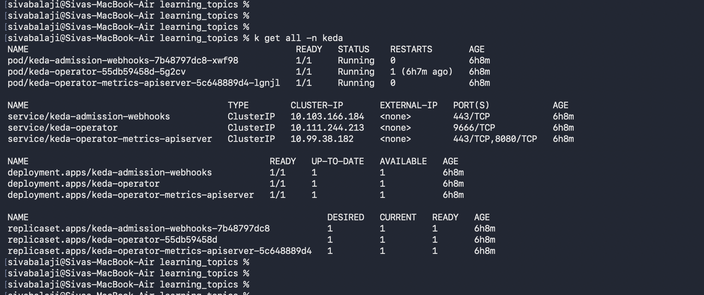
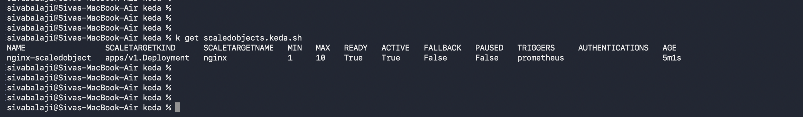
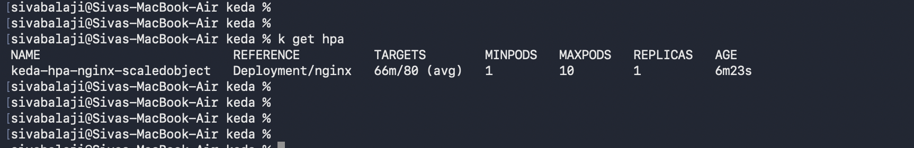

Keda is the Kubernetes Event Driven Autoscaler. 

You can install the KEDA using the HELM charts. please find below 

```
helm repo add kedacore https://kedacore.github.io/charts
helm repo update

helm install keda kedacore/keda --namespace keda --create-namespace
```

you can get pods and all other objects in keda namespace using below.

```
kubectl get all -n keda
```




Inorder to implement it, first create the deployment using nginx pod. Try to create a sidecar container that scrapes the metrics and make it available at /metrics on container port 9113.

```configmap.yaml

apiVersion: v1
kind: ConfigMap
metadata:
  name: nginx-config
  labels:
    app: nginx
data:
  nginx.conf: |
    server {
        listen 80;
        location / {
            root /usr/share/nginx/html;
            index index.html;
        }
        location /nginx_status {
            stub_status;
            allow all;
        }

    }

```

``` deployment.yaml
apiVersion: apps/v1
kind: Deployment
metadata:
  name: nginx
spec:
  replicas: 1
  selector:
    matchLabels:
      app: nginx
  template:
    metadata:
      labels:
        app: nginx
    spec:
      containers:
      - name: nginx
        image: nginx:latest
        ports:
        - containerPort: 80
        volumeMounts:
        - name: nginx-config-volume
          mountPath: /etc/nginx/conf.d
        resources:
          limits:
            cpu: "500m"
            memory: "256Mi"
          requests:
            cpu: "250m"
            memory: "128Mi"
      
      - name: nginx-prometheus-exporter
        image: nginx/nginx-prometheus-exporter:latest
        args:
        - "-nginx.scrape-uri=http://localhost/nginx_status"
        ports:
        - containerPort: 9113

      volumes:
      - name: nginx-config-volume
        configMap:
          name: nginx-config
        

---
apiVersion: v1
kind: Service
metadata:
  name: nginx-service
  labels:
    app: nginx
spec:
  selector:
    app: nginx
  ports:
  - protocol: TCP
    port: 80
    targetPort: 80
    name: http
  - protocol: TCP
    port: 9113
    targetPort: 9113
    name: metrics
  type: ClusterIP

```

Create a service monitor so that prometheus can able to find the nginx pods and scrape the metrics. 

``` servicemonitor.yaml
apiVersion: monitoring.coreos.com/v1
kind: ServiceMonitor
metadata:
  name: nginx-servicemonitor
  labels:
    release: kube-prometheus-stack
spec:
  selector:
    matchLabels:
      app: nginx
  endpoints:
  - port: metrics
    interval: 15s 
    path: /metrics
  namespaceSelector:
    matchNames:
    - default
```

At the end , create the keda object called Scaledobject which is maintained by keda operator and it will take care of scaling the pods by getting the metrics from prometheis directly by passing the adpater and k8s metrics. 



It will create the HPA object in the backend 



``` keda.yaml
apiVersion: keda.sh/v1alpha1
kind: ScaledObject
metadata:
  name: nginx-scaledobject
spec:
  scaleTargetRef:
    name: nginx
  minReplicaCount: 1
  maxReplicaCount: 10
  pollingInterval: 15
  cooldownPeriod: 30
  triggers:
  - type: prometheus
    metadata:
      serverAddress: http://kube-prometheus-stack-prometheus.monitoring.svc.cluster.local:9090
      metricName: nginx_requests_per_second
      threshold: "80"
      query: |
        sum(rate(nginx_http_requests_total{namespace!="",pod!=""}[1m])) by (pod)
      
```

In this way, you can use keda to scale the pods based on different aspects.


